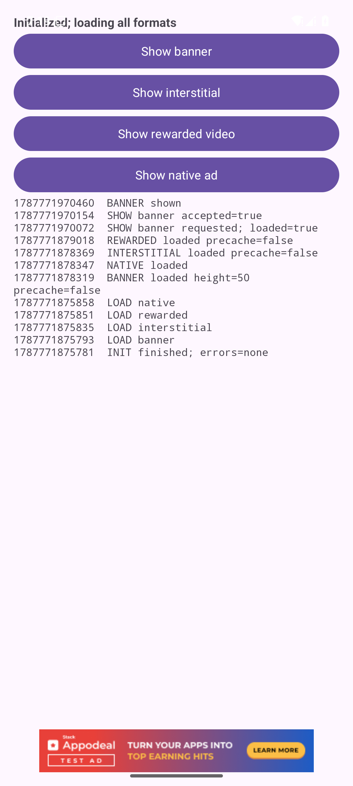
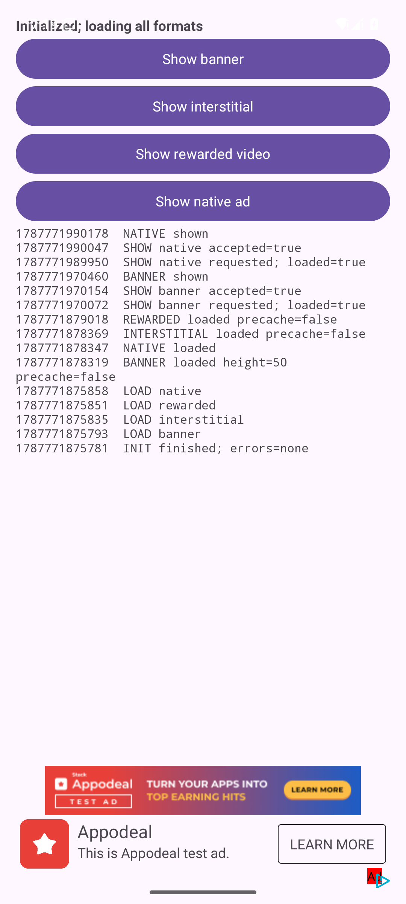

# QA Documentation

## Result

Runtime verification completed successfully on 2026-08-26. A real Appodeal Test Mode creative was displayed for Banner, Interstitial, Rewarded Video, and Native Ads. SDK initialization completed with no reported initialization errors, and the requested load/display callbacks were captured from the same final application run.

## Evidence provided

All files below are in the `qa-artifacts` directory of the submission package.

| Requirement | Evidence | What it demonstrates |
| --- | --- | --- |
| Banner screenshot | `01-banner.png` | Appodeal `TEST AD` banner displayed inside the app; in-app event log includes `BANNER shown` |
| Interstitial screenshot | `03-interstitial.png` | Fullscreen Appodeal `TEST AD` interstitial |
| Rewarded screenshot | `04-rewarded.png` | Fullscreen Appodeal rewarded test creative |
| Native Ad screenshot | `02-native.png` | Appodeal `TEST AD` native card registered and displayed in the app |
| Successful initialization log | `sdk-initialization.log` | SDK 4.3.0 startup, adapter registration, Test Mode, and successful initialization; app key is redacted |
| Application callback log | `runtime-callbacks.log` | Initialization, explicit load requests, loaded/shown/closed/finished callbacks for the final run |
| Installable build | `appodeal-test-debug.apk` | The exact debug APK used for final runtime verification |
| APK metadata | `apk-info.txt` | APK filename, byte size, and checksum |

The four image files are screenshots from the running API 35 emulator; they are not mockups.

## Screenshots

### Banner



### Native Ad



### Interstitial


### Rewarded Video


## Console log: successful initialization and loading

Filtered Logcat tag: `AppodealSample`. This is an excerpt from `runtime-callbacks.log`:

```text
08-26 19:17:55.781 I/AppodealSample: INIT finished; errors=none
08-26 19:17:55.793 I/AppodealSample: LOAD banner
08-26 19:17:55.834 I/AppodealSample: LOAD interstitial
08-26 19:17:55.851 I/AppodealSample: LOAD rewarded
08-26 19:17:55.858 I/AppodealSample: LOAD native
08-26 19:17:58.319 I/AppodealSample: BANNER loaded height=50 precache=false
08-26 19:17:58.347 I/AppodealSample: NATIVE loaded
08-26 19:17:58.369 I/AppodealSample: INTERSTITIAL loaded precache=false
08-26 19:17:59.017 I/AppodealSample: REWARDED loaded precache=false
```

## Console log: display callbacks

```text
08-26 19:19:30.072 I/AppodealSample: SHOW banner requested; loaded=true
08-26 19:19:30.154 I/AppodealSample: SHOW banner accepted=true
08-26 19:19:30.459 I/AppodealSample: BANNER shown

08-26 19:19:49.949 I/AppodealSample: SHOW native requested; loaded=true
08-26 19:19:50.045 I/AppodealSample: SHOW native accepted=true
08-26 19:19:50.177 I/AppodealSample: NATIVE shown

08-26 19:20:04.969 I/AppodealSample: SHOW interstitial requested; loaded=true
08-26 19:20:05.002 I/AppodealSample: SHOW interstitial accepted=true
08-26 19:20:06.901 I/AppodealSample: INTERSTITIAL shown
08-26 19:20:39.298 I/AppodealSample: INTERSTITIAL closed

08-26 19:20:42.437 I/AppodealSample: SHOW rewarded requested; loaded=true
08-26 19:20:42.454 I/AppodealSample: SHOW rewarded accepted=true
08-26 19:20:43.506 I/AppodealSample: REWARDED shown
08-26 19:21:35.580 I/AppodealSample: REWARDED finished amount=0.0 currency=
08-26 19:21:35.587 I/AppodealSample: REWARDED closed finished=true
```

`amount=0.0` and an empty currency are the values emitted by this Test Mode creative; the application logs the callback values without modifying them.

## Brief implementation explanation

The application is a single-activity Kotlin project. Before initialization it:

1. Registers `BannerCallbacks`, `InterstitialCallbacks`, `RewardedVideoCallbacks`, and `NativeCallbacks`.
2. Enables Test Mode and verbose SDK logging.
3. Connects the XML banner view and disables auto-cache for all four formats so loading is explicit.
4. Initializes `BANNER | INTERSTITIAL | REWARDED_VIDEO | NATIVE` with the Appodeal key supplied only through local build configuration.

After the initialization callback, `loadAll()` calls `Appodeal.cache(...)` separately for each format. The four buttons first log `Appodeal.isLoaded(...)`, then show the selected format. Native Ads use `Appodeal.getNativeAds(1)` and `NativeAdViewNewsFeed.registerView(...)`. Every SDK callback method writes to Logcat with tag `AppodealSample` and to the on-screen event list.

The source implements all callback methods exposed by the four interfaces, including loaded, failed-to-load, shown, show-failed, clicked, expired, closed, and rewarded-finished where applicable. A successful test does not naturally trigger every failure/click/expiry branch; no user ad click or artificial failure was introduced simply to manufacture those events.

## Build and runtime environment

- Windows host
- JDK 21
- Gradle 8.7
- Android Gradle Plugin 8.6.1
- compile/target SDK 35; min SDK 26
- Appodeal Android SDK core 4.3.0
- API 35 Google APIs x86_64 emulator
- Package: `com.appodealsdktest.codex.a20260826f3c7`
- Verified APK size: 20,195,707 bytes
- SHA-256: `5125AD78821C8D3A71B229B952262938E31905FA9FAD97E754B0C99D8FC90E95`

## Troubleshooting

### Problems encountered and investigation

| Problem | Investigation | Resolution / status |
| --- | --- | --- |
| Android build tools were unavailable in the initial environment | Checked Java, Gradle, Android SDK, `adb`, and emulator availability independently | JDK 21 was already installed. Gradle 8.7, Android command-line tools, SDK 35, Build Tools, emulator, and an API 35 system image were downloaded and installed under `D:\Appodeal-build-tools` |
| Original package name could not be added in Appodeal Dashboard | Dashboard stated that the app could already exist in this or another account; changing only the display title did not address Bundle ID uniqueness | Created and used the unique Android package `com.appodealsdktest.codex.a20260826f3c7` |
| App key from `local.properties` was blank at runtime | Compared generated `BuildConfig` behavior with Gradle property sources | Loaded `local.properties` explicitly with `java.util.Properties`; the key is excluded from source control and QA logs |
| Core plus BidMachine produced `ADAPTER NOT FOUND` for Appodeal/MRAID/VAST test waterfalls | Enabled verbose SDK logging and compared registered adapters against the official Mediation Wizard and Testing guidance | Added the wizard's non-optional Bidon and iAB adapter artifacts; Appodeal, MRAID, and VAST then registered and ads loaded |
| Initialization returned a non-fatal configuration error although ads worked | Inspected full SDK logs and decompiled the relevant core 4.3.0 networking path; the error occurred when the server JSON had no `services` object | Added Appodeal's official Sentry Analytics service adapter. The final cold run reported `INIT finished; errors=none`. This is recorded as a configuration-specific workaround, not a universal dependency requirement |
| HTTPS requests failed in the emulator with `Trust anchor for certification path not found` | Compared host/emulator TLS behavior and identified Avast HTTPS inspection | Exported only Avast's public root and installed it in the disposable AVD. A debug-only network security resource trusts user CAs; main/release trusts system CAs only |
| First Banner/Native load once timed out | Used verbose SDK networking/adapter logs and retried on the same AVD | Retry succeeded; the final clean run loaded all four formats on the first request |
| Drive `C:` had no usable free space for SDK/system image/build artifacts | Checked free space and Gradle/AVD write failures | Installed toolchain, AVD, build copy, APK, and QA evidence on `D:` |
| Dashboard still showed `No First Ad impression yet` after runtime success | Refreshed the SDK integration page after displaying the real Test Mode creatives | Dashboard reporting was not confirmed and may be delayed. This document relies on the screenshots and device Logcat and does not claim that the dashboard updated |

### Hypotheses that were tested and rejected

- Legacy `com.appodeal.ads.sdk.networks:appodeal`, `mraid`, and `vast` 3.0.2.0 artifacts could be resolved by Gradle, but SDK 4.3.0 did not register them. They were removed.
- Appodeal core 3.12.0 did not bundle all required test adapters as initially suspected. Its runtime still reported missing adapters, so the project returned to stable core 4.3.0.
- A single BidMachine adapter was not enough for all four official Test Mode waterfalls in this account configuration; runtime logs, not the build result, exposed the missing Appodeal/MRAID/VAST implementations.

### Official documentation used

- [Android Get Started](https://docs.appodeal.com/android/get-started): repository/dependency setup, initialization, and general integration order.
- [Testing](https://docs.appodeal.com/android/advanced/testing): enabling Test Mode and the need for the Mediation Wizard's required adapters for reliable test fill.
- [Configure Mediated Networks](https://docs.appodeal.com/android/advanced/configure-mediated-networks): adapter selection and mediation configuration.
- [Banner](https://docs.appodeal.com/android/ad-types/banner), [Interstitial](https://docs.appodeal.com/android/ad-types/interstitial), [Rewarded Video](https://docs.appodeal.com/android/ad-types/rewarded-video), and [Native Ads](https://docs.appodeal.com/android/ad-types/native): loading, display APIs, and callback contracts.
- [Official Android demo repository](https://github.com/appodeal/appodeal-android-sdk): sample project structure and SDK usage cross-checks.

### AI tools used

OpenAI Codex (GPT-5 family) was used for source implementation, official-documentation research, terminal/build/emulator automation, Logcat analysis, code inspection, screenshot collection, and preparation of this documentation. Codex's in-app browser helped inspect the Appodeal Dashboard and official Mediation Wizard while preserving the signed-in session.

### AI answers that were incorrect or incomplete

The following early AI assumptions were verified against the compiler or runtime and corrected:

- It initially described the machine as lacking the full Android toolchain, but JDK 21 was already installed; only Gradle/Android SDK/emulator components were missing.
- It first suggested the wrong Maven coordinate `com.appodeal.ads:sdk:4.3.0`. The working official coordinate is `com.appodeal.ads.sdk:core:4.3.0` plus selected adapter artifacts.
- Some initially suggested initialization/native imports did not match SDK 4.3.0. Compiler errors and the actual AAR API were used to correct the imports and callback signatures.
- It initially assumed core plus BidMachine would be sufficient. Runtime Test Mode waterfalls proved that Bidon/iAB implementations were also needed.
- It hypothesized that legacy 3.0.2 network artifacts or core 3.12.0 might provide the missing built-ins. Both ideas were tested and rejected based on adapter-registration logs.
- It assumed Gradle's `providers.gradleProperty(...)` would read `local.properties`; it does not. Explicit `Properties` loading fixed the missing key.

## Remaining uncertainties

- Appodeal Dashboard impression propagation is not verified even though all formats were displayed and device callbacks were captured.
- The Sentry service-adapter workaround is verified for this exact SDK/account response, but Appodeal support should clarify whether the missing `services` object with a mediation-only dependency set is expected.
- Click, failure, show-failure, and expiry callbacks are implemented but were not triggered during the successful final run.
